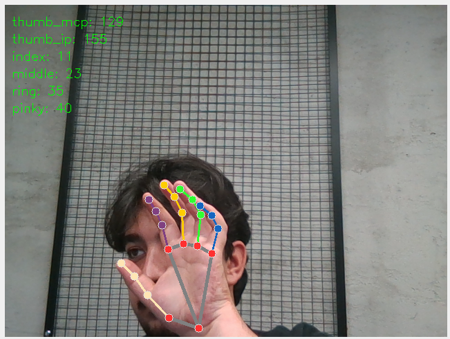

# 🤖 Hand Mimic System


<p align="center">
  
  <br>
  <em>A system that transfers your hand movements to a robotic hand in real-time</em>
</p>

## 📋 Project Overview

The Hand Mimic System is a computer vision project that detects human hand movements and replicates them on a robotic hand. Using the MediaPipe hand detection library, it calculates finger angles through a webcam and transmits this data to an Arduino to control servo motors.

### ✨ Features

- **Real-Time Tracking**: Low-latency hand movement tracking with MediaPipe
- **Precise Angle Calculations**: Angular measurements for each finger
- **Smooth Movement**: Motion smoothing algorithm to prevent servo jitter
- **Calibration Mode**: Customizable fine-tuning system for different hand sizes
- **Modular Structure**: Professional architecture for easy maintenance and development

## 🛠️ Components

### Software Requirements
- Python 3.7+
- OpenCV
- MediaPipe
- NumPy
- PySerial

### Hardware Requirements
- Webcam
- Arduino Uno/Nano/Mega
- Servo motors (minimum 6)
- 5V power supply (for servos)
- Robotic hand mechanism/framework

## 📦 Installation

### 1. Clone the Repository

```bash
git clone git@github.com:cnosmn/robo-hand-with-ai.git
cd robo-hand-with-ai
```

### 2. Install Python Dependencies

```bash
pip install -r requirements.txt
```

### 3. Arduino Setup

1. Open Arduino IDE
2. Load `arduino/hand_mimic_controller/hand_mimic_controller.ino`
3. Adjust connection pins according to your hardware setup
4. Upload to Arduino

### 4. Servo Motor Connections

Connect servo motors to Arduino according to the following pin configuration:

| Servo (Finger) | Arduino Pin |
|----------------|-------------|
| Thumb MCP      | 3           |
| Thumb IP       | 5           |
| Index Finger   | 6           |
| Middle Finger  | 9           |
| Ring Finger    | 10          |
| Pinky Finger   | 11          |

**Note**: Due to high current draw, it's recommended to use an external 5V power supply instead of powering servos from Arduino's 5V pin.

## 🚀 Usage

### Normal Mode

```bash
python main.py --port /dev/ttyUSB0  # Enter your Arduino port
```

For Windows:
```bash
python main.py --port COM3  # Enter the correct COM port
```

### Calibration Mode

```bash
python main.py --calibrate --port /dev/ttyUSB0
```

During calibration:
1. Press SPACE to start/pause calibration
2. Fully open and close your hand to teach the system angle ranges
3. Press S to view calibration data
4. Update the calibration values in `config/settings.py` under `FINGER_ANGLE_RANGES`
5. Press Q to exit

### Key Controls

- **Q**: Exit program
- **SPACE**: Start/pause calibration (in calibration mode)
- **S**: Save calibration results (in calibration mode)

## 📁 Project Structure

```
hand_mimic_system/
│
├── main.py                 # Main entry point
├── requirements.txt        # Dependencies
│
├── arduino/                # Arduino code
│   └── hand_mimic_controller/
│       └── hand_mimic_controller.ino
│
├── config/                 # Configuration
│   ├── __init__.py
│   └── settings.py         # Settings and constants
│
├── hand_tracking/          # Hand detection and angle calculations
│   ├── __init__.py
│   ├── hand_detector.py    # MediaPipe hand detection module
│   └── angle_calculator.py # Finger angle calculation module
│
├── serial_comm/            # Arduino communication
│   ├── __init__.py
│   └── arduino_comm.py     # Serial port communication module
│
├── utils/                  # Helper modules
│   ├── __init__.py
│   └── calibration.py      # Calibration functions
│
└── visualization/          # Visualization
    ├── __init__.py
    └── renderer.py         # Frame processing and display
```

## 🔄 Communication Protocol

Communication between the Python program and Arduino uses the following format:

```
movefingers:thumb_mcp:thumb_ip:index:middle:ring:pinky
```

Example: `movefingers:90:120:45:30:50:60`

Each value represents a servo angle between 0-180 degrees.

## 📝 Customization

### Servo Movement Speed Adjustment

You can adjust movement speed by modifying the `MOVEMENT_DELAY` variable in the Arduino code:

```cpp
// In Arduino code
const int MOVEMENT_DELAY = 5; // Lower = faster, higher = slower
```

### Angle Mapping Settings

Customize the mapping of finger angles to servo angles in `config/settings.py`:

```python
# In Python code
FINGER_ANGLE_RANGES = {
    'thumb_mcp': (120, 170),  # (min_angle, max_angle)
    'thumb_ip': (120, 170),
    'index': (120, 170),
    'middle': (120, 170),
    'ring': (120, 170),
    'pinky': (120, 170)
}
```

## 📊 Performance Optimizations

- **Smooth Movement**: Angle values are filtered with a smoothing algorithm for fluid motion
- **Efficient Updates**: Only angles that change beyond a threshold are sent to Arduino
- **Frequency Limiting**: Command transmission is limited at specific intervals to reduce servo load

## 🔧 Troubleshooting

### Arduino Connection Issues
- Verify the Arduino is connected
- Ensure you're using the correct port address
- Allow time for Arduino to reset after connection

### Servo Jitter Problems
- Use an external power supply for servo motors
- Increase `MOVEMENT_DELAY` in Arduino code
- Run calibration mode to set more accurate angle ranges

### Hand Detection Issues
- Work in a well-lit environment
- Adjust MediaPipe detection parameters in `config/settings.py`
- Try reducing camera resolution and fps

## 🤝 Contributing

1. Fork this repository
2. Create your feature branch (`git checkout -b feature/amazing-feature`)
3. Commit your changes (`git commit -m 'Add amazing feature'`)
4. Push to the branch (`git push origin feature/amazing-feature`)
5. Open a Pull Request

## 🙏 Acknowledgments

- [MediaPipe](https://mediapipe.dev/) - For hand detection
- [OpenCV](https://opencv.org/) - For image processing
- [Arduino](https://www.arduino.cc/) - For servo control

---

<p align="center">
  <sub>Developed by &copy; 2025 Your Name</sub>
</p>
